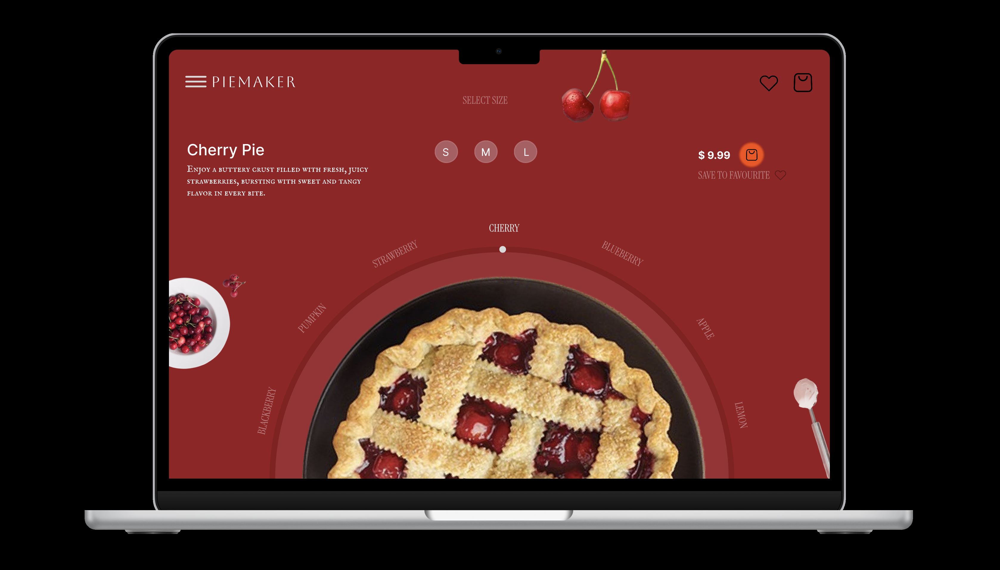
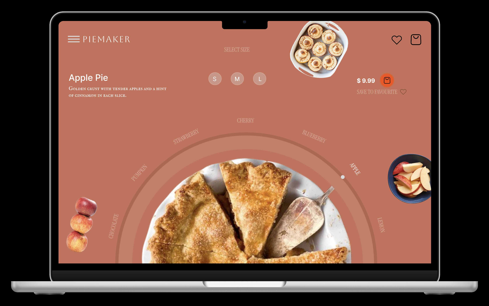
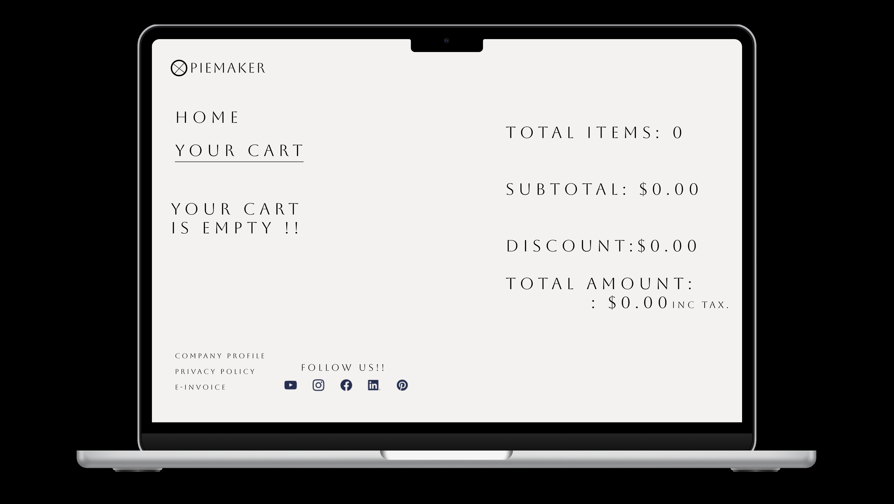
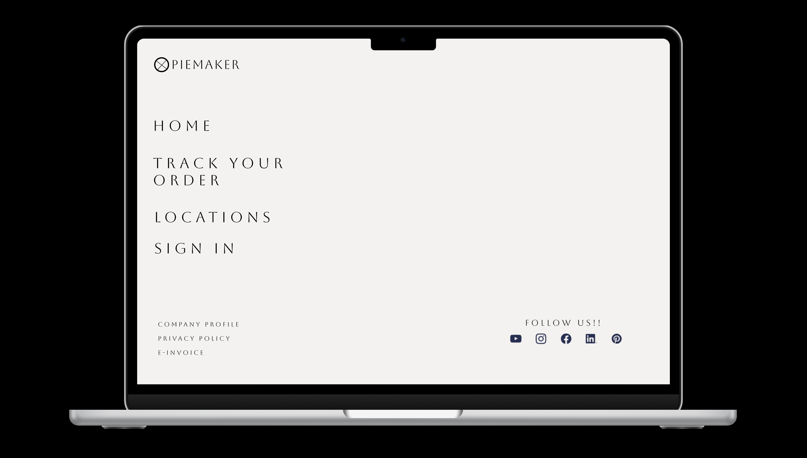

# PieMaker UI

Interactive dessert ordering interface designed in Figma.

## Features
- Minimal dark theme
- Interactive flavor selector
- Product-focused layout
- Modern e-commerce inspired layout

## Tools Used
- Figma
- UI/UX Design

## Preview
## Live Prototype
[Open Figma Prototype](https://www.figma.com/proto/mSIJTIp0nDCvwnJen7lJP7/PIEMAKER?node-id=99-130&starting-point-node-id=60%3A20)

### Home Screen

### Preview Page

### Cart Page

### Option / Interaction

